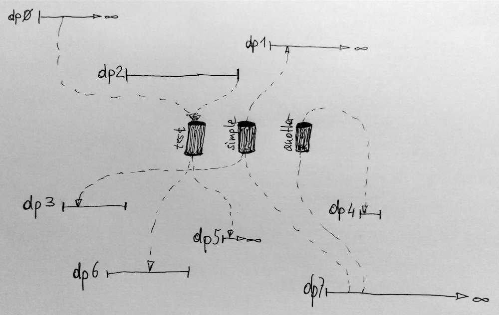

# dnpipes

Distributed Named Pipes (or: `dnpipes`) are essentially a distributed version of Unix [named pipes](http://en.wikipedia.org/wiki/Named_pipe) comparable to, for example, [SQS](https://aws.amazon.com/sqs/) in AWS or the [Service Bus](https://azure.microsoft.com/en-us/services/service-bus/) in Azure.

Conceptually, we're dealing with a bunch of distributed processes (`dpN` above). These distributed processes may be long-running (such as `dp0` or `dp5`) or batch-oriented ones, for example `dp3` or `dp6`. There are a number of [situations](#use-cases) where you want these distributed processes to communicate, very similar to what [IPC](http://tldp.org/LDP/lpg/node7.html) enables you to do on a single machine. Now, `dnpipes` are a simple mechanism to facilitate IPC between distributed processes. What follows is an [interface specification](#interface-specification) as well as a [reference implementation](#reference-implementation) for `dnpipes`.

## Interface specification

Interpret the key words "MUST", "MUST NOT", "REQUIRED", "SHALL", "SHALL NOT", "SHOULD", "SHOULD NOT", "RECOMMENDED", "MAY", "MAY NOT", and "OPTIONAL" in the context of this repo as defined in [RFC 2119](https://tools.ietf.org/html/rfc2119).

A `dnpipe` is a distributed ordered queue (FIFO) of messages available to a number of participating distributed processes. A distributed process is a useful abstraction provided by systems such as DC/OS (for example a Marathon app or a Metronome job) or Kubernetes (ReplicaSet or a Job) that give a user the illusion that a service or application she is executing on a bunch of commodity machines (the cluster) behaves like one global entity while it really is a collection of locally executed processes. In DC/OS this locally executed process would be a [Mesos task](http://mesos.apache.org/documentation/latest/architecture/) and in Kubernetes a [pod](http://kubernetes.io/docs/api-reference/v1/definitions/#_v1_podspec).

A `dnpipes` implementation MUST support the following operations:

- `push(TOPIC, MSG)` … executed by a publisher, this writes the message `MSG` to a `dnpipe` called `TOPIC`.
- `MSG <- pull(TOPIC)` … executed by a subscriber, this reads a message from a `dnpipe` called `TOPIC`.
- `reset(TOPIC)` … executed by either a publisher or consumer, this removes all messages from a `dnpipe` called `TOPIC`.

The following MUST be true at any point in time:

1. After `push` is executed by the publisher `MSG` MUST be available for `pull` to any participant until `reset` is triggered and has completed.
1. A `pull` does not remove a message from a `dnpipe`, it merely delivers its content to the consumer.
1. The way how participants discover a `dnpipe` is outside of the scope of this specification.

Note concerning the last point: since there are many ways to implement service discovery in a distributed system we do not expect that an agreement can be found here hence we leave it up to the implementation how to go about it. The next sections shows an example using Kafka and DNS to achieve this.

## Use cases

A `dnpipe` can be useful in a number of situations including but not limited to the following:

- To implement a work queue with, for example: [Adron/testing-aws-sqs-worker](https://github.com/Adron/testing-aws-sqs-worker)
- To do event dispatching in microservices, for example: [How we build microservices at Karma](https://blog.karmawifi.com/how-we-build-microservices-at-karma-71497a89bfb4)
- To coordinate Function-as-a-Service executions, for example: [Integrate SQS and Lambda: serverless architecture for asynchronous workloads](https://cloudonaut.io/integrate-sqs-and-lambda-serverless-architecture-for-asynchronous-workloads/)
