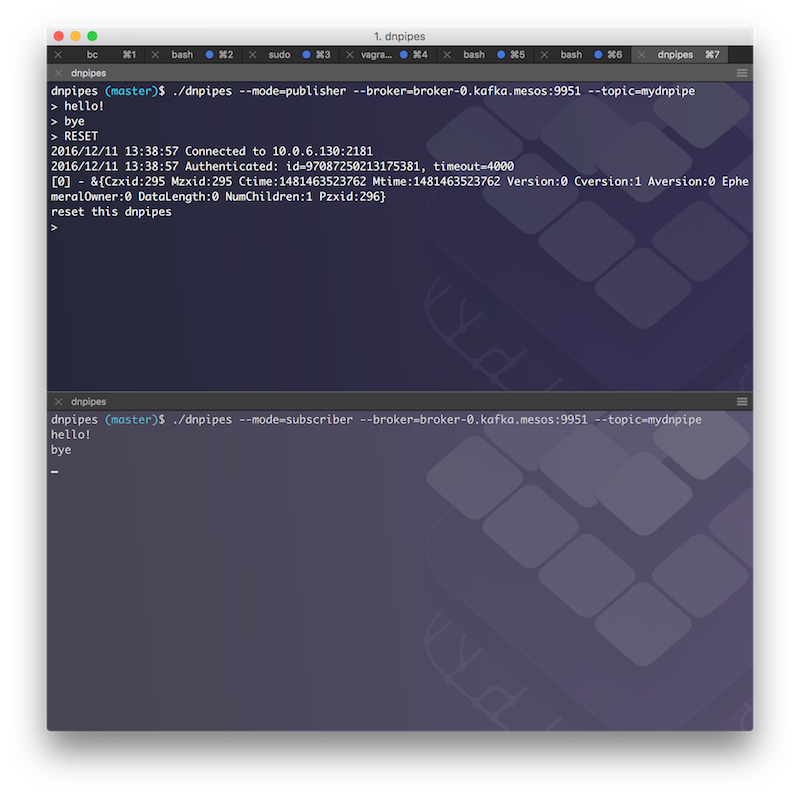

# dnpipes

Distributed Named Pipes, short: `dnpipes`, are essentially a distributed variant of Unix [named pipes](http://en.wikipedia.org/wiki/Named_pipe). They play a similar role, for example, [SQS](https://aws.amazon.com/sqs/) plays in AWS or the [Service Bus](https://azure.microsoft.com/en-us/services/service-bus/) plays in Azure. 


Conceptually, we're dealing with a bunch of distributed processes (`dpN` above). These distributed processes may be long-running (such as `dp0` or `dp5`) or batch-oriented ones, for example `dp3` or `dp6`. There are a number of [situations](#use-cases) where you want these distributed processes to communicate, very similar to what [IPC](http://tldp.org/LDP/lpg/node7.html) enables you to do on a single machine. Now, `dnpipes` are a simple mechanism to facilitate IPC between distributed processes. What follows is an [interface specification](#interface-specification) as well as a [reference implementation](#reference-implementation) for `dnpipes`.

## Interface specification

Interpret the key words "MUST", "MUST NOT", "REQUIRED", "SHALL", "SHALL NOT", "SHOULD", "SHOULD NOT", "RECOMMENDED", "MAY", "MAY NOT", and "OPTIONAL" in the context of this repo as defined in [RFC 2119](https://tools.ietf.org/html/rfc2119).

A dnpipes implementation MUST support two operations:

- `push(TOPIC, MSG)`
- `pull(TOPIC)`

## Reference implementation

The reference implementation of `dnpipes` is based on [DC/OS](https://dcos.io) using [Apache Kafka](http://kafka.apache.org/).

### Install

From source:

```bash
$ go get github.com/mhausenblas/dnpipes
$ go build
```

From binaries:

TBD

### Example session

An example session looks as follows. I've set up two terminals, in one I'm starting the publisher:

```bash
$ ./dnpipes --mode=publisher --broker=broker-0.kafka.mesos:9951 --topic=test
PUBLISH> hello!
PUBLISH> bye
```

The second terminal has a subscriber running:

```bash
$ ./dnpipes --mode=subscriber --broker=broker-0.kafka.mesos:9951 --topic=test 2>/dev/null
hello!
bye
```

And here's a screen shot of the whole thing:



## Use cases

TBD